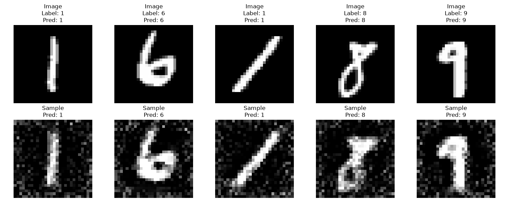
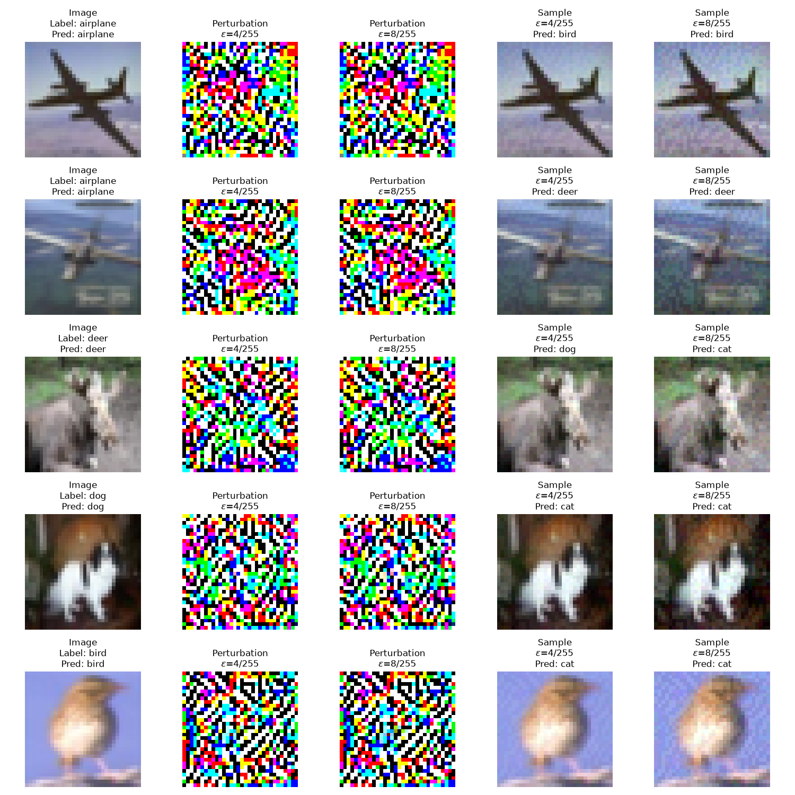

# 针对 CNN 模型的攻击练习

本仓库存放了以课程实验为基础的基于 MindSpore 框架的对 CNN 模型的攻击实践代码。

## 环境依赖

- MindSpore 框架版本： `2.8.0`
- Python 版本： `3.12`

## 运行测试

执行以下命令即可运行测试文件，分别从模型数据逆向、模型后门植入与利用以及 FGSM 对抗样本生成三个方面进行攻击测试。

```bash
make test
```

执行以下命令即可清理测试过程中生成的权重、样本和结果等文件。

```bash
make clean
```

## 结果示例

执行模型数据逆向攻击测试后，可获得如下图所示的结果示意图，对比展示原始样本与逆向恢复样本。



执行 FGSM 对抗样本生成 攻击测试后，可获得如下图所示的结果示意图，对比展示原始样本、两个不同扰动参数下的扰动与对应的对抗样本。

